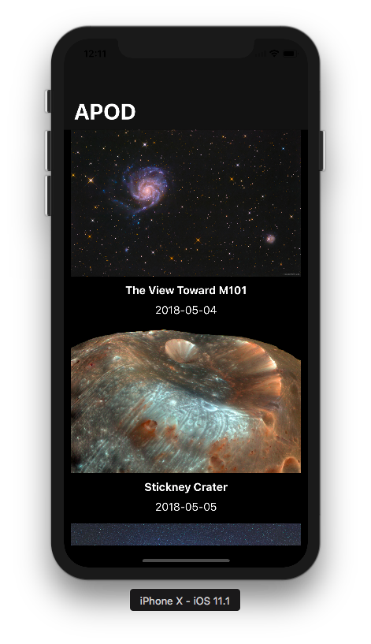

# APOD

Each day a different image or photograph of our fascinating universe is featured, along with a brief explanation written by a professional astronomer.

<h3 align="center">

</h3>

## Compatibility

This project is written in Swift 4 and requires Xcode 9.1 to build and run.

## Developer

* [Vinoth Vino](https://twitter.com/vinothvino42)
